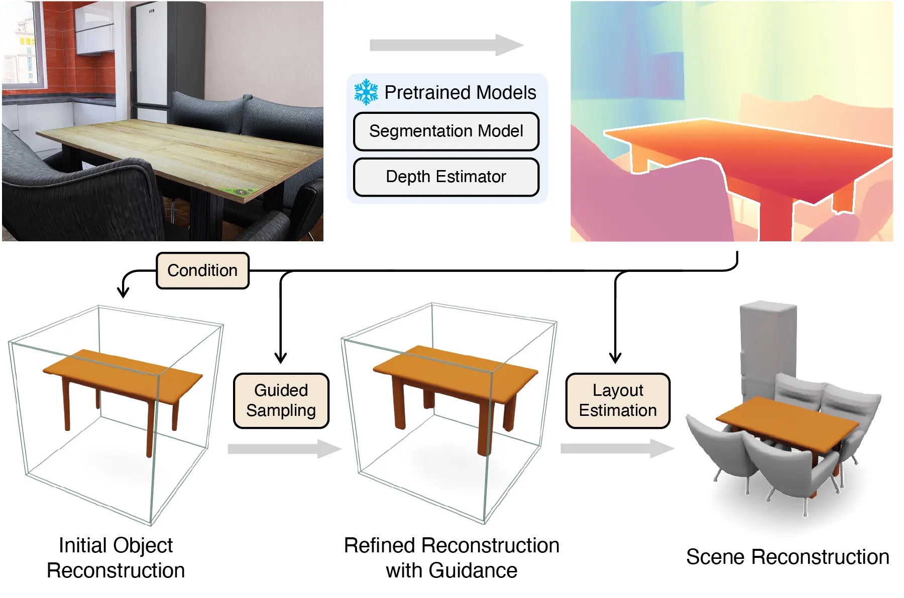

<p align="center">

  <h1 align="center"><a href="https://mlpc-ucsd.github.io/DepR/">DepR</a>: Depth Guided Single-view Scene Reconstruction with Instance-level Diffusion</h1>
  <p align="center">
    <a href="https://clarivy.github.io/" target="_blank"><strong>Qingcheng Zhao</strong></a><sup>*,1,&dagger;</sup>
    ·
    <a href="https://xzhang.dev/" target="_blank"><strong>Xiang Zhang</strong></a><sup>*,&#9993;,2</sup>
    ·
    <a href="https://xxuhaiyang.github.io/" target="_blank"><strong>Haiyang Xu</strong></a><sup>2</sup>
    ·
    <a href="https://zeyuan-chen.com/" target="_blank"><strong>Zeyuan Chen</strong></a><sup>2</sup>
    ·
    <a href="http://www.stat.ucla.edu/~jxie/" target="_blank"><strong>Jianwen Xie</strong></a><sup>3</sup>
    ·
    <a href="https://scholar.google.com/citations?user=z0BX_4wAAAAJ&hl=en" target="_blank"><strong>Yuan Gao</strong></a><sup>4</sup>
    ·
    <a href="https://pages.ucsd.edu/~ztu/" target="_blank"><strong>Zhuowen Tu</strong></a><sup>2</sup>
  </p>
  <p align="center">
    <sup>1</sup><strong>ShanghaiTech University</strong>
    ·
    <sup>2</sup><strong>UC San Diego</strong>
    ·
    <sup>3</sup><strong>Lambda, Inc.</strong>
    ·
    <sup>4</sup><strong>Stanford University</strong>
  </p>
  
  <p align="center">
    <strong><i style="color:red;">ICCV 2025</i></strong>
  </p>

  <p align="center" style="font-size: 80%;">
    <sup>*</sup>
    <strong>equal contribution</strong>
    &nbsp;&nbsp;
    <sup>&#9993;</sup>
    <strong>corresponding author</strong>
   </div>
  
  <p align="center" style="font-size: 70%;">
    <sup>&dagger;</sup>
    <i>Project done while Qingcheng Zhao interned at UC San Diego.</i>
  </p>

</p>

<h3 align="center">
  <a href="https://mlpc-ucsd.github.io/DepR/"><strong>Project Page</strong></a>
  |
  <a href="https://openaccess.thecvf.com/content/ICCV2025/papers/Zhao_DepR_Depth_Guided_Single-view_Scene_Reconstruction_with_Instance-level_Diffusion_ICCV_2025_paper.pdf">Paper</a>
  |
  <a href="https://arxiv.org/abs/2507.22825"><strong>arXiv</strong></a>
</h3>


<div align="center">
  
</div>


## 🛠️ Environment Setup
We provide a pre-built Docker image at [zx1239856/depr](https://hub.docker.com/r/zx1239856/depr) based on `PyTorch 2.7.1` and `CUDA 12.6`. You can also build the image locally:
```bash
docker build -f Dockerfile . -t depr
```

Alternatively, you can install dependencies based on commands listed in [Dockerfile](Dockerfile).

## 🗂️ Dataset Setup
Please download processed 3D-FRONT dataset from [https://huggingface.co/datasets/zx1239856/DepR-3D-FRONT](https://huggingface.co/datasets/zx1239856/DepR-3D-FRONT). Extract the downloaded files into `datasets/front3d_pifu/data`. The result folder structure should look like
```
data/
|-- metadata/             (Scene metadata)
|   |-- 0.jsonl
|   |-- ...
|-- pickled_data/         (Raw data processed by InstPIFu)
|   |-- test/
|       |-- rendertask3000.pkl
|       |-- ...
|-- sdf_layout/           (GT layouts)
|   |-- 10000.npy
|   |-- ...
|- 3D-FUTURE-watertight/  (GT meshes, required for evaluation)
|   |-- 0004ae9a-1d27-4dbd-8416-879e9de1de8d/
|       |-- raw_watertight.obj
|       |-- ...
|-- instpifu_mask/        (Instance masks provided by InstPIFu)
|-- panoptic/             (Panoptic segmentation maps we rendered)
|-- img/                  (Optional, can be extracted from pickled data)
|-- depth/depth_pro/      (Optional)
`-- grounded_sam/         (Optional)
```

Alternatively, you may generate depth / segmentation yourself based on instructions below.
<details>
<summary><b>Generate Segmentation</b></summary>

Please prepare [Grounded SAM](https://github.com/IDEA-Research/Grounded-Segment-Anything) weights in `checkpoint/grounded_sam`.
```
grounded_sam/
|-- GroundingDINO_SwinB.py
|-- groundingdino_swinb_cogcoor.pth
|-- groundingdino_swint_ogc.pth
`-- sam_vit_h_4b8939.pth
```

```bash
python -m scripts.run_grounded_sam
```
</details>

<details>
<summary><b>Generate Depth</b></summary>

Please put [Depth Pro](https://github.com/apple/ml-depth-pro) weights in `checkpoint/`.

```bash
python -m scripts.run_depth_pro --output depth_pro
```

</details>

## 📊 Inference
Please download our weights from [https://huggingface.co/zx1239856/DepR](https://huggingface.co/zx1239856/DepR) and put everything in the `checkpoint` folder.

### 🚀 Demo
We provide a [demo.ipynb](./demo.ipynb) notebook for inference demo on real-world images.

<details open>
<summary><b>Object-level Evaluation</b></summary>

You may change 8 to the actual number of GPUs as needed.

```bash
bash launch.sh 8 all
```
</details>

<details>
<summary><b>(Optional) Guided Sampling</b></summary>

```bash
bash launch.sh 8 all --guided
```
</details>

<details open>
<summary><b>Scene-level Evaluation</b></summary>

```bash
# Generate shapes
bash launch.sh 8 sample --metadata datasets/front3d_pifu/meta/test_scene.jsonl --use-sam

# Layout optim
bash launch.sh 8 scene --use-sam

# Prepare GT scene
python -m scripts.build_gt --out-dir output/gt

# Calculate scene-level CD/F1
accelerate launch --num_processes=8 --multi_gpu -m scripts.eval_scene --gt-pcd-dir output/gt/pcds --pred-dir output/infer/sam_3dproj_attn_dino_c9_augdep_augmask_nocfg_model_0074999/ --save-dir output/evaluation/results --method depr
```
</details>

## 🏷️ License
This repository is released under the [CC-BY-SA 4.0](LICENSE) license. 

## 🙏 Acknowledgement
Our framework utilizes pre-trained models including [Grounded-Segment-Anything](https://github.com/IDEA-Research/Grounded-Segment-Anything), [Depth Pro](https://github.com/apple/ml-depth-pro), and [DINO v2](https://github.com/facebookresearch/dinov2).

Our code is built upon [diffusers](https://github.com/huggingface/diffusers), [Uni-3D](https://github.com/mlpc-ucsd/Uni-3D), and [BlockFusion](https://github.com/Tencent/BlockFusion).

We use physically based renderings of [3D-FRONT](https://tianchi.aliyun.com/specials/promotion/alibaba-3d-scene-dataset) scenes provided by [InstPIFu](https://github.com/GAP-LAB-CUHK-SZ/InstPIFu). Additionally, we rendered panoptic segmentation maps ourselves.

We thank all these authors for their nicely open sourced code/datasets and their great contributions to the community.

## 📝 Citation
If you find our work useful, please consider citing:
```bibtex
@InProceedings{Zhao_2025_ICCV_DepR,
    author    = {Zhao, Qingcheng and Zhang, Xiang and Xu, Haiyang and Chen, Zeyuan and Xie, Jianwen and Gao, Yuan and Tu, Zhuowen},
    title     = {DepR: Depth Guided Single-view Scene Reconstruction with Instance-level Diffusion},
    booktitle = {Proceedings of the IEEE/CVF International Conference on Computer Vision (ICCV)},
    month     = {October},
    year      = {2025},
    pages     = {5722-5733}
}
```
